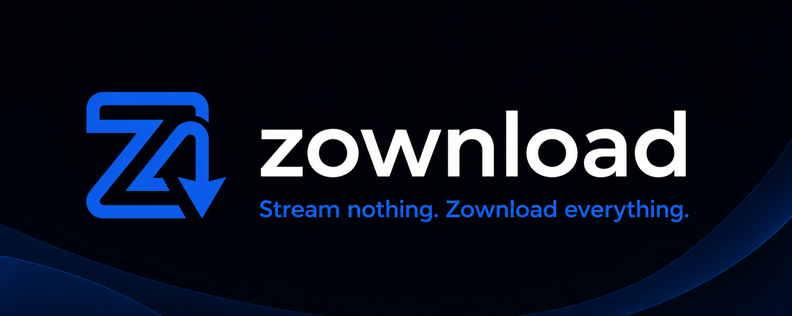
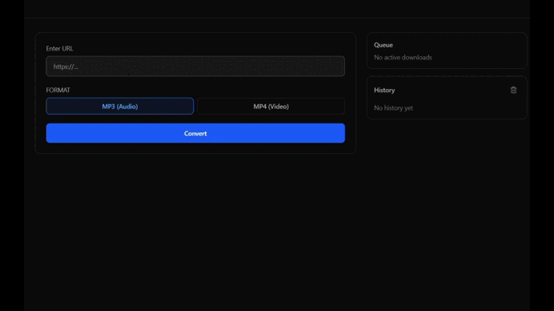

<p align="center">
  
</p>

# zownload

Zownload is a web application that allows you to extract, convert, and download media from hundreds of platforms.

<p align="center">
  
</p>

## Features
- Analyze URLs to fetch available media formats and playlists.
- Download media directly in audio (MP3) or video (MP4) formats.

## Supported Platforms
Zownload is powered by `yt-dlp` under the hood, which means it supports hundreds of platforms out of the box. Some of the most popular include:
- **YouTube** (Videos, Shorts, Playlists)
- **Twitter / X**
- **Instagram** (Reels)
- **Facebook**
- **Pornhub**
- ...and many more!

## Requirements

- **To run the app**: [Docker] is the only requirement.
- **To develop locally**: [Node.js] (v20+) and [pnpm] are also required.

## Installation and use (Docker)

The easiest way to run Zownload is using Docker. You do not need Node.js installed on your machine for this.

1. **Clone the repository:**
   ```bash
   git clone https://github.com/zahidzta/zownload.git
   cd zownload
   ```

2. **First-time Run (Builds the images):**
   
   > The first time you run this command it will take a few minutes to build the images.

   ```bash
   docker compose up --build -d
   ```

3. **Subsequent Runs:**
   
   If you have already executed the previous command and just want to start the project again, use this faster command:

   ```bash
   docker compose up -d
   ```

- The **Frontend** will be available at `http://localhost:3000`
- The **Backend** will be available at `http://localhost:4000`

4. **Stopping the application:**
   
   To stop the background containers, use this command:

   ```bash
   docker compose stop
   ```
   *(To stop and completely remove the containers and network, you can use `docker compose down` instead).*

## Local Development Setup

If you want to modify the code or run the project outside of Docker:

1. **Install dependencies and setup workspace:**
   ```bash
   pnpm setup
   ```
2. **Start the development servers:**
   ```bash
   pnpm dev:frontend
   pnpm dev:backend
   ```

## Project Structure
- `/apps/frontend`: Next.js web interface.
- `/apps/backend`: Express.js API and WebSocket server for handling media downloads.
- `/packages/shared`: Shared TypeScript types across the workspace.

## Disclaimer

> This project was created solely for educational and research purposes regarding multimedia processing, streaming flows, and modern web architectures. It is not designed to infringe on copyright or promote the unauthorized distribution of content. The use of this tool is the sole responsibility of the end user, who must respect the platforms' terms of service and applicable intellectual property laws.
